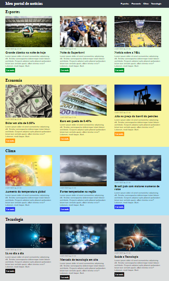

# Atividade modulo css
### Descrição:
- Criar mais duas seções no layout criado durante o módulo, por exemplo: entretenimento e tecnologia, as novas seções devem conter outras notícias e diferentes cores.

- Enviar os arquivos para o Github em uma branch chamada exercicio-css.

- Atividade pode ser acessada entrando na branch: exercicio-css.

    

